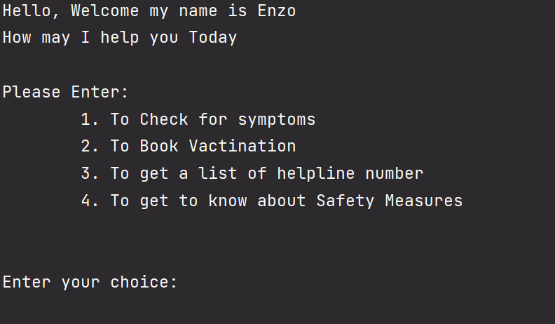

# Covid ChatBot 🗯️

### ``Features 😷`` 
> 1. Symptons Checks
> 2. Vaccination Details
> 3. HelpLine Numbers
> 4. Safety Measures

#### *HOW TO USED THIS BOT:*
* Clone the Repo 
```gh repo clone mohammedkharoda/Covid-HelpBot```
* Run the Covid__Chat__Bot.py
* The Bot is at your servcies 🥳


### Demo:
| | |
| ----------- | ----------- |




### > Have a Nice day `Happy Coding 💻`